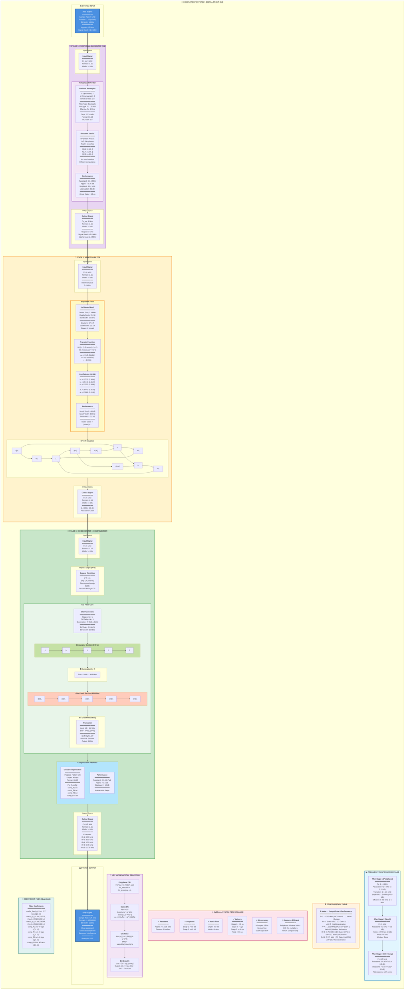

```mermaid
---
config:
  theme: default
---
graph TB
    subgraph MainDFE["<b>🎯 COMPLETE DFE SYSTEM - DIGITAL FRONT END</b>"]
        direction TB
        
        subgraph SystemInput["<b>📥 SYSTEM INPUT</b>"]
            ADCInput["<b>ADC Output</b><br/>━━━━━━━━━━<br/>Sample Rate: 9 MHz<br/>Format: s1.15 (16-bit)<br/>Bit Width: 16 bits<br/>━━━━━━━━━━<br/>Nyquist: 4.5 MHz<br/>Signal Band: 0-2.8 MHz"]
        end
        
        subgraph Stage1["<b>🔷 STAGE 1: FRACTIONAL DECIMATOR (2/3)</b>"]
            direction TB
            
            subgraph PolyInput["Input Specs"]
                P1In["<b>Input Signal</b><br/>━━━━━━━━━━<br/>Fs_in: 9 MHz<br/>Format: s1.15<br/>Width: 16 bits"]
            end
            
            subgraph PolyFilter["<b>Polyphase FIR Filter</b>"]
                direction TB
                PolyDesc["<b>Rational Resampler</b><br/>━━━━━━━━━━━━━━<br/>L (Upsample): 2<br/>M (Downsample): 3<br/>Effective Rate: 2/3<br/>━━━━━━━━━━━━━━<br/>Filter Type: Equiripple<br/>Prototype Fc: 1.5 MHz<br/>Effective Fc: 3 MHz<br/>━━━━━━━━━━━━━━<br/>Taps: 227 coeffs<br/>Format: Q1.15<br/>DC Gain: 2.0"]
                
                PolyStruct["<b>Structure Details</b><br/>━━━━━━━━━━━━━━<br/>M=3 Main Phases<br/>L=2 Sub-phases<br/>Total: 6 branches<br/>━━━━━━━━━━━━━━<br/>h[0,6,12,18...]<br/>h[1,7,13,19...]<br/>h[2,8,14,20...]<br/>━━━━━━━━━━━━━━<br/>No zero insertion<br/>Efficient computation"]
                
                PolyPerf["<b>Performance</b><br/>━━━━━━━━━━━━━━<br/>Passband: 0-1.4 MHz<br/>Ripple: < 0.25 dB<br/>Stopband: 1.6+ MHz<br/>Attenuation: 80 dB<br/>━━━━━━━━━━━━━━<br/>Group Delay: ~18 μs"]
            end
            
            subgraph PolyOutput["Output Specs"]
                P1Out["<b>Output Signal</b><br/>━━━━━━━━━━<br/>Fs_out: 6 MHz<br/>Format: s1.15<br/>Width: 16 bits<br/>━━━━━━━━━━<br/>Nyquist: 3 MHz<br/>Signal Band: 0-2.8 MHz<br/>Interference: 2.4 MHz"]
            end
            
            P1In --> PolyDesc
            PolyDesc --> PolyStruct
            PolyStruct --> PolyPerf
            PolyPerf --> P1Out
        end
        
        subgraph Stage2["<b>🔶 STAGE 2: IIR NOTCH FILTER</b>"]
            direction TB
            
            subgraph NotchInput["Input Specs"]
                N1In["<b>Input Signal</b><br/>━━━━━━━━━━<br/>Fs: 6 MHz<br/>Format: s1.15<br/>Width: 16 bits<br/>━━━━━━━━━━<br/>Interference at:<br/>2.4 MHz"]
            end
            
            subgraph NotchFilter["<b>Biquad IIR Filter</b>"]
                direction TB
                NotchDesc["<b>2nd Order Notch</b><br/>━━━━━━━━━━━━━━<br/>Center Freq: 2.4 MHz<br/>Quality Factor: Q=30<br/>Bandwidth: 100 kHz<br/>━━━━━━━━━━━━━━<br/>Structure: DF-II-T<br/>Coefficients: Q2.14<br/>Stages: 1 biquad"]
                
                NotchMath["<b>Transfer Function</b><br/>━━━━━━━━━━━━━━<br/>H(z) = (1-2cos(ω₀)z⁻¹+z⁻²)<br/>      /(1-2rcos(ω₀)z⁻¹+r²z⁻²)<br/>━━━━━━━━━━━━━━<br/>ω₀ = 2π(2.4M)/6M<br/>r = e^(-π·BW/fs)<br/>r ≈ 0.9598"]
                
                NotchCoeffs["<b>Coefficients (Q2.14)</b><br/>━━━━━━━━━━━━━━<br/>b₀ = 15725 (0.9598)<br/>b₁ = 25443 (1.5529)<br/>b₂ = 15725 (0.9598)<br/>━━━━━━━━━━━━━━<br/>a₁ = 25443 (1.5529)<br/>a₂ = 15066 (0.9196)"]
                
                NotchPerf["<b>Performance</b><br/>━━━━━━━━━━━━━━<br/>Notch Depth: -60 dB<br/>Notch Width: 80 kHz<br/>Passband: < 0.5 dB<br/>━━━━━━━━━━━━━━<br/>Stable poles: ✓<br/>|poles| < 1"]
            end
            
            subgraph NotchStructure["<b>DF-II-T Structure</b>"]
                direction LR
                NIn["x[n]"] --> NB0["×b₀"]
                NB0 --> NSum["Σ"]
                NSum --> NOut["y[n]"]
                
                NIn --> NS1["s₁"]
                NS1 --> NB1["×b₁"]
                NB1 --> NSum
                NOut --> NA1["×(-a₁)"]
                NA1 --> NS1
                
                NS1 --> NS2["s₂"]
                NS2 --> NB2["×b₂"]
                NB2 --> NSum
                NOut --> NA2["×(-a₂)"]
                NA2 --> NS2
            end
            
            subgraph NotchOutput["Output Specs"]
                N1Out["<b>Output Signal</b><br/>━━━━━━━━━━<br/>Fs: 6 MHz<br/>Format: s1.15<br/>Width: 16 bits<br/>━━━━━━━━━━<br/>2.4 MHz: -60 dB<br/>Passband: Clean"]
            end
            
            N1In --> NotchDesc
            NotchDesc --> NotchMath
            NotchMath --> NotchCoeffs
            NotchCoeffs --> NotchPerf
            NotchPerf --> NotchStructure
            NotchStructure --> N1Out
        end
        
        subgraph Stage3["<b>🔷 STAGE 3: CIC DECIMATOR + COMPENSATION</b>"]
            direction TB
            
            subgraph CICInput["Input Specs"]
                C1In["<b>Input Signal</b><br/>━━━━━━━━━━<br/>Fs: 6 MHz<br/>Format: s1.15<br/>Width: 16 bits"]
            end
            
            subgraph CICBypass["<b>Bypass Logic (R=1)</b>"]
                BypassDesc["<b>Bypass Condition</b><br/>━━━━━━━━━━━━━━<br/>IF R = 1:<br/>  Skip CIC entirely<br/>  Direct passthrough<br/>ELSE:<br/>  Process through CIC"]
            end
            
            subgraph CICCore["<b>CIC Filter Core</b>"]
                direction TB
                CICSpec["<b>CIC Parameters</b><br/>━━━━━━━━━━━━━━<br/>Stages: N = 5<br/>Diff Delay: M = 1<br/>Decimation: R ∈ {2,4,8,16}<br/>━━━━━━━━━━━━━━<br/>DC Gain: (R×M)^N<br/>Bit Growth: ΔW bits"]
                
                subgraph Integrators["<b>∫ Integrator Section (6 MHz)</b>"]
                    direction LR
                    Int1["∫₁"] --> Int2["∫₂"] --> Int3["∫₃"] --> Int4["∫₄"] --> Int5["∫₅"]
                end
                
                subgraph Decimator["<b>⬇ Decimation by R</b>"]
                    DecDesc["Rate: 6 MHz → 6/R MHz"]
                end
                
                subgraph Combs["<b>d/dz Comb Section (6/R MHz)</b>"]
                    direction LR
                    Comb1["d/dz₁"] --> Comb2["d/dz₂"] --> Comb3["d/dz₃"] --> Comb4["d/dz₄"] --> Comb5["d/dz₅"]
                end
                
                subgraph Scaling["<b>Bit Growth Handling</b>"]
                    ScaleDesc["<b>Truncation</b><br/>━━━━━━━━━━━━━━<br/>Input: 16 + ΔW bits<br/>ΔW = N×log₂(R×M)<br/>━━━━━━━━━━━━━━<br/>Shift Right: ΔW<br/>Round & Saturate<br/>Output: 16 bits"]
                end
                
                CICSpec --> Integrators
                Integrators --> Decimator
                Decimator --> Combs
                Combs --> Scaling
            end
            
            subgraph CompFIR["<b>Compensation FIR Filter</b>"]
                direction TB
                CompDesc["<b>Droop Compensation</b><br/>━━━━━━━━━━━━━━<br/>Purpose: Flatten CIC<br/>Length: 40 taps<br/>Format: Q1.15<br/>━━━━━━━━━━━━━━<br/>Per R config:<br/>comp_R2.txt<br/>comp_R4.txt<br/>comp_R8.txt<br/>comp_R16.txt"]
                
                CompPerf["<b>Performance</b><br/>━━━━━━━━━━━━━━<br/>Passband: 0-0.45×Fs/2<br/>Ripple: < 0.5 dB<br/>Stopband: > 60 dB<br/>━━━━━━━━━━━━━━<br/>Inverse sinc shape"]
            end
            
            subgraph CICOutput["Output Specs"]
                C1Out["<b>Output Signal</b><br/>━━━━━━━━━━<br/>Fs: 6/R MHz<br/>Format: s1.15<br/>Width: 16 bits<br/>━━━━━━━━━━<br/>Examples:<br/>R=1: 6.00 MHz<br/>R=2: 3.00 MHz<br/>R=4: 1.50 MHz<br/>R=8: 0.75 MHz<br/>R=16: 0.375 MHz"]
            end
            
            C1In --> CICBypass
            CICBypass --> CICCore
            CICCore --> CompFIR
            CompFIR --> C1Out
        end
        
        subgraph SystemOutput["<b>📤 SYSTEM OUTPUT</b>"]
            FinalOut["<b>DFE Output</b><br/>━━━━━━━━━━<br/>Sample Rate: 6/R MHz<br/>Format: s1.15 (16-bit)<br/>Bit Width: 16 bits<br/>━━━━━━━━━━<br/>Clean passband<br/>Attenuated stopband<br/>Removed interference<br/>━━━━━━━━━━<br/>Ready for DSP"]
        end
        
        ADCInput ==> P1In
        P1Out ==> N1In
        N1Out ==> C1In
        C1Out ==> FinalOut
        
        subgraph FreqResponse["<b>📊 FREQUENCY RESPONSE PER STAGE</b>"]
            direction TB
            
            FR1["<b>After Stage 1 (Polyphase)</b><br/>━━━━━━━━━━━━━━<br/>Fs: 9→6 MHz<br/>Passband: 0-1.4 MHz (< 0.25 dB)<br/>Transition: 1.4-1.6 MHz<br/>Stopband: 1.6+ MHz (> 80 dB)<br/>Effective: 0-2.8 MHz at 6 MHz"]
            
            FR2["<b>After Stage 2 (Notch)</b><br/>━━━━━━━━━━━━━━<br/>Fs: 6 MHz<br/>Passband: 0-3 MHz (< 0.5 dB)<br/>Notch: 2.4 MHz (-60 dB)<br/>Width: 80 kHz<br/>All other: Pass"]
            
            FR3["<b>After Stage 3 (CIC+Comp)</b><br/>━━━━━━━━━━━━━━<br/>Fs: 6/R MHz<br/>Passband: 0-0.45×Fs/2 (< 0.5 dB)<br/>Stopband: > 0.55×Fs/2 (> 60 dB)<br/>Flat response with comp"]
            
            FR1 --> FR2
            FR2 --> FR3
        end
        
        subgraph ConfigTable["<b>⚙️ CONFIGURATION TABLE</b>"]
            direction TB
            
            CT["<b>R Value → Output Rate & Performance</b><br/>━━━━━━━━━━━━━━━━━━━━━━━━━━━━━━<br/>R=1:  6.000 MHz | DC Gain=1      | ΔW=0  | Bypass<br/>R=2:  3.000 MHz | DC Gain=32     | ΔW=5  | Light decimation<br/>R=4:  1.500 MHz | DC Gain=1024   | ΔW=10 | Medium decimation<br/>R=8:  0.750 MHz | DC Gain=32768  | ΔW=15 | Heavy decimation<br/>R=16: 0.375 MHz | DC Gain=1048576| ΔW=20 | Max decimation"]
        end
        
        subgraph PerformanceMetrics["<b>⚡ OVERALL SYSTEM PERFORMANCE</b>"]
            direction TB
            
            Perf1["<b>✓ Passband</b><br/>━━━━━━━━━━<br/>Ripple: < 0.5 dB total<br/>Flatness: Excellent"]
            
            Perf2["<b>✓ Stopband</b><br/>━━━━━━━━━━<br/>Stage 1: > 80 dB<br/>Stage 3: > 60 dB"]
            
            Perf3["<b>✓ Notch Filter</b><br/>━━━━━━━━━━<br/>Depth: -60 dB<br/>Width: 80 kHz"]
            
            Perf4["<b>✓ Latency</b><br/>━━━━━━━━━━<br/>Stage 1: ~18 μs<br/>Stage 2: ~1 μs<br/>Stage 3: < 40 μs<br/>Total: < 60 μs"]
            
            Perf5["<b>✓ Bit Accuracy</b><br/>━━━━━━━━━━<br/>All stages: 16-bit<br/>No overflow<br/>Stable operation"]
            
            Perf6["<b>✓ Resource Efficient</b><br/>━━━━━━━━━━<br/>Polyphase: Minimal MACs<br/>CIC: No multipliers<br/>Notch: 1 biquad only"]
        end
        
        subgraph MathFormulas["<b>📐 KEY MATHEMATICAL RELATIONS</b>"]
            direction TB
            
            M1["<b>Polyphase FIR:</b><br/>H(e^jω) = Σ h[n]e^(-jωn)<br/>Fc_effective = Fc_prototype × L"]
            
            M2["<b>Notch IIR:</b><br/>H(z) = (1-2cos(ω₀)z⁻¹+z⁻²)/(1-2rcos(ω₀)z⁻¹+r²z⁻²)<br/>ω₀ = 2πf₀/fs, r = e^(-πΔf/fs)"]
            
            M3["<b>CIC Filter:</b><br/>H(z) = [(1-z^(-RM))/(1-z⁻¹)]^N<br/>|H(f)| = |sin(πfRM)/sin(πf)|^N"]
            
            M4["<b>Bit Growth:</b><br/>ΔW = ⌈N × log₂(R×M)⌉<br/>Output_bits = Input_bits + ΔW → Truncate"]
            
            M1 --> M2
            M2 --> M3
            M3 --> M4
        end
        
        subgraph CoeffFiles["<b>📁 COEFFICIENT FILES (Quantized)</b>"]
            direction TB
            
            Files["<b>Filter Coefficients</b><br/>━━━━━━━━━━━━━━━━<br/>coeffs_fixed_q15.txt: 227 taps (Q1.15)<br/>notch_b_q14.txt: [15725, 25443, 15725] (Q2.14)<br/>notch_a_q14.txt: [16384, 25443, 15066] (Q2.14)<br/>comp_R2.txt: 40 taps (Q1.15)<br/>comp_R4.txt: 40 taps (Q1.15)<br/>comp_R8.txt: 40 taps (Q1.15)<br/>comp_R16.txt: 40 taps (Q1.15)"]
        end
    end
    
    style ADCInput fill:#4a90e2,stroke:#2e5c8a,stroke-width:4px,color:#fff
    style FinalOut fill:#4a90e2,stroke:#2e5c8a,stroke-width:4px,color:#fff
    
    style Stage1 fill:#e8d5f2,stroke:#8e44ad,stroke-width:3px
    style Stage2 fill:#fff3cd,stroke:#f57c00,stroke-width:3px
    style Stage3 fill:#c8e6c9,stroke:#43a047,stroke-width:3px
    
    style PolyFilter fill:#f3e5f5,stroke:#8e44ad,stroke-width:2px
    style NotchFilter fill:#fff9c4,stroke:#f57c00,stroke-width:2px
    style CICCore fill:#e8f5e9,stroke:#43a047,stroke-width:2px
    
    style FreqResponse fill:#e1f5fe,stroke:#0277bd,stroke-width:2px
    style ConfigTable fill:#fff3e0,stroke:#ef6c00,stroke-width:2px
    style PerformanceMetrics fill:#fce4ec,stroke:#c2185b,stroke-width:2px
    style MathFormulas fill:#f3e5f5,stroke:#8e24aa,stroke-width:2px
    style CoeffFiles fill:#e0f2f1,stroke:#00695c,stroke-width:2px
    
    style Integrators fill:#c5e1a5
    style Combs fill:#ffccbc
    style CompFIR fill:#b3e5fc
```